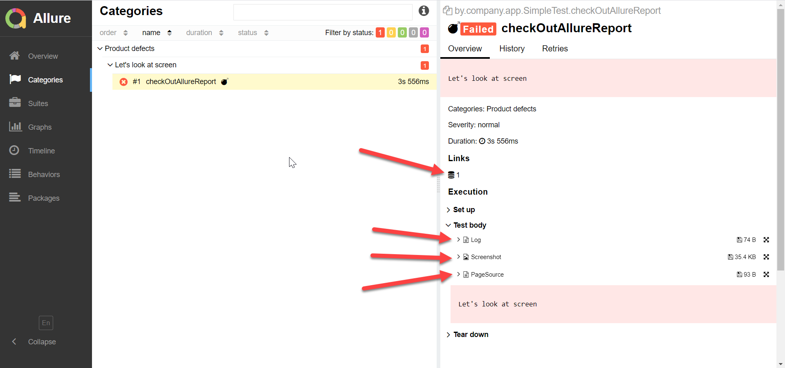

Steps to reproduce:

1. Build mvn project (mvn clean test)
2. Make sure that is added artifacts with path "/target/allure-results" 
3. Go to build directory, execute command in terminal "mvn allure:serve"
4. Check out report with generated path

11.05.2020 UPD:

1. Attach link to Tms using reflection
2. Attach html page source link
3. Attach img
4. Attach log in borders one test

